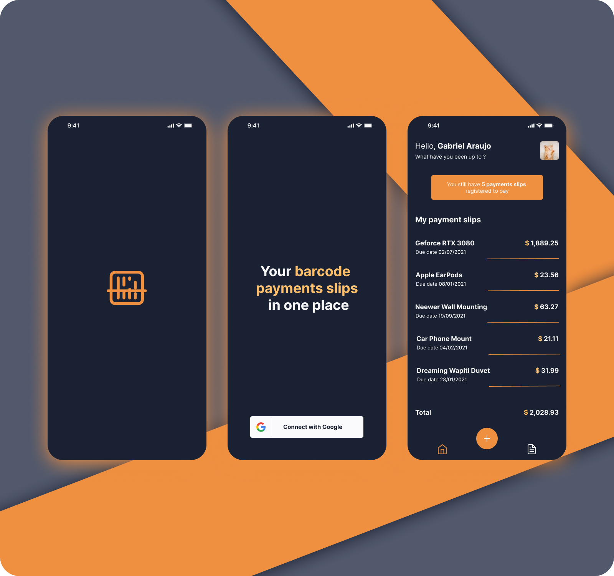

<div align="center">

## Barcode Wallet


</div>

##



## 💡 Purpose

This app was made to serve as a portfolio to illustrate my skills and quality of my work. I hope you enjoy it !

## 💻 Project

Barcode Wallet is app where you can scan and store your barcode payment slips. Is a good way to remember which one is already paid or those that need to be paid yet.

## 🛠️ Features

- [ ] Users can sign in with Google Account;
- [ ] Users can scan your payment slip by it's barcode;
- [ ] Allows to add barcode payment slip;
- [ ] Allows to delete barcode payment slip;

## ✨ Technologies

- [ ] React Native CLI
- [ ] TypeScript
- [ ] Firebase Social Authentication with Google
- [ ] Cloud Firestore
- [ ] ML Kit
- [ ] Cloud Firestore
- [ ] Context API
- [ ] Custom Hooks
- [ ] Styled Components
- [ ] React Native Svg & Svg Transform
- [ ] React Native Testing Library
- [ ] Google Fonts

## 🖍️ Layout

Barcode Wallet layout is available on Figma. You can access [through this link](https://www.figma.com/file/Wq2fF0t9T30NV0NjdUUzb3/Barcode-Wallet?node-id=0%3A1).

## 🚩 Getting Started

In case if you don't have your development environment setting up, check this [React Native Documentation](https://reactnative.dev/docs/environment-setup) to learn how to do so.

Clone this project repository

```
git clone git@github.com:gsaaraujo/barcode-wallet.git
```

Type **yarn install** or **npm install** to install all dependencies.

After, run:

```
yarn start
```

And:

```
yarn android
```

Before running the app, you need to register the app and set your own credentials on [Firebase Console ](https://firebase.google.com/).

After taking google-services.json to the right place, as the documentation says, add the client_id to .env.example file.

This app works for Android only.
